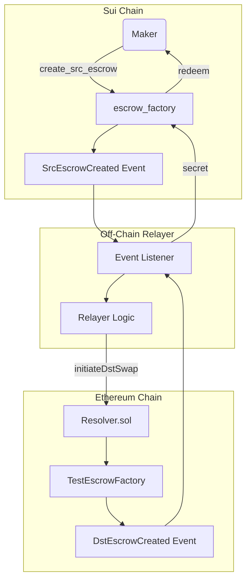
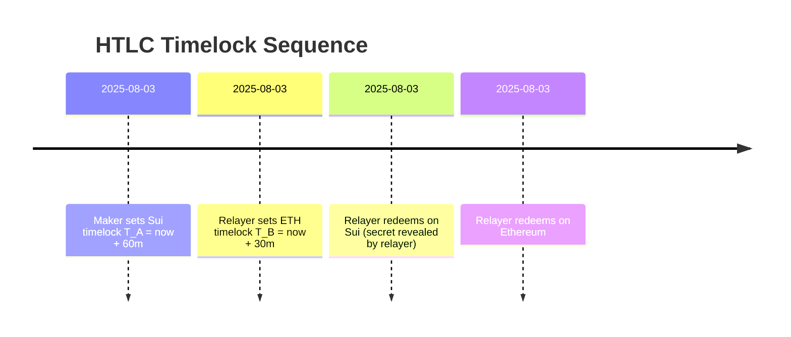

# Cross-Chain HTLC Swap: Sui & Ethereum (Fusion+ Extension)

<p align="center">
  
</p>

## Table of Contents

1. [Project Overview](#project-overview)
2. [Core Concepts: HTLC](#core-concepts-htlc)
3. [Architecture & Flow Diagrams](#architecture--flow-diagrams)
4. [Contract Details](#contract-details)
5. [Setup & Deployment](#setup--deployment)
6. [Manual Testing Guide](#manual-testing-guide)
8. [Future Work & Enhancements](#future-work--enhancements)
9. [Contributing & License](#contributing--license)

---

## 1. Project Overview

This repository demonstrates a cross-chain atomic swap between the Sui blockchain (Move) and Ethereum (Solidity) using Hashed Timelock Contracts (HTLCs). It includes:

* **On-Chain Components**: Sui `escrow_factory` Move module (simple swap and partial fills); Ethereum `TestEscrowFactory`, `Resolver`, and predeployed mainnet contracts for 1inch LOP and ERC20.
* **Off-Chain Relayer**: A conceptual service to monitor events, propagate secrets, and manage timelock-based redemption/refund across chains.
  
---

## 2. Core Concepts: HTLC

HTLCs ensure atomicity via two primitives:

* **Hashlock**: Locks funds behind a cryptographic hash (`secret_hash`). Revealing the preimage (`secret`) redeems the funds.
* **Timelock**: Allows refunding locked funds after a deadline if the secret is not revealed.

**Swap Flow**:

For SUI -> ETH swap
1. Maker announces his/her signed order with the secret to the relayer , which in turn the relayer annouces to all resolvers.
1. Resolver locks maker Sui tokens → HTLC-A with `timelock_A`.
2. Relayer locks Ethereum → HTLC-B with `timelock_B < timelock_A`.
3. Relayer redeems HTLC-A (reveals `secret`).
4. Realayer redeems HTLC-B for maker using revealed `secret`.

If either party misses the window, they can refund their own HTLC after expiry.
Similarly for ETH -> SUI swap

---

## 3. Architecture & Flow Diagrams

### 3.1. High-Level Architecture



### 3.2. Swap Timeline



This ensures Relayer always has time to reveal before their own funds unlock.

---

## 4. Contract Details

### 4.1. Sui Move Modules

* **`escrow_factory for single fill swap`**: Handles `create_src_escrow`, `create_dst_escrow`, `redeem`, and `refund`. Emits events and enforces timelocks.
* **`escrow_factory for partial fill swap`**: Handles `create_src_escrow`, `place_order`, `fill_order`, `create_dst_escrow`, `redeem`, and `refund`. Emits events and enforces timelocks.

### 4.2. Ethereum Solidity Contracts

* **`TestEscrowFactory.sol`**: Factory for per-swap `TestEscrow` contracts.
* **`Resolver.sol`**: Orchestrates `initiateDstSwap`, `redeem`, and `refund`. Integrates mock 1inch LOP via `IOrderMixin`.

---

## 5. Setup & Deployment

### 5.1. Prerequisites

* Git, Rust, Cargo (for move and sui tools)
* Sui CLI
* Foundry (`forge`, `anvil`)
* Node.js & pnpm/npm/yarn (optional for frontend)

### 5.2. Mainner for Ethereum and Devnet for Sui Networks

1. **Start Sui**:

   ```bash
   To connect with the devnet:
    1) sui client new-env --alias devnet --rpc https://fullnode.devnet.sui.io:443
    2) sui client switch -env devnet
   ```
   
2. **Start Ethereum**:

   ```bash
    1) Create account on Tenderly
    2) fork the chain on which you want to work on
    3) save the RPC URL in env
    4) Fund the wallets
   ```

### 5.3. Deploy Contracts

#### Sui:

```bash
cd sui_contracts/fusion_contracts
sui client publish --gas-budget 10000000  # escrow_factory
```

#### Ethereum:

```bash
cd ethereum_contracts
forge install
# Set PRIVATE_KEY & INITIAL_OWNER env vars
forge script script/Deploy.s.sol --rpc-url <RPC_URL> --broadcast
```

---

## 6. Manual Testing Guide

1) cross_chain_resolver_example folder (tests)
    - pnpm i
    - forge install
    - pnpm test <TEST_PATH>

2) sui_contracts folder
    - sui publish

3) x_susion (Frontend)
    - pnpm i
    - pnpm run dev

---

## 8. Future Work & Enhancements

* Automated Relayer Service (Node.js)
* Support additional Sui tokens (e.g., Coin<USDC>)
* Decentralized relayer network with staking
* Complete Frontend UI & UX

---

## 9. Contributing & License

Licensed under MIT. See [LICENSE](LICENSE) for details.
